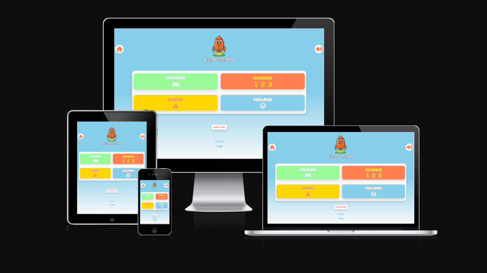

# Little Launch Pad Quiz Game

## By Ed Chalk

[View the live project here.](https://edchalk96.github.io/little-launch-pad/)

[View the repository here](https://github.com/edchalk96/little-launch-pad)

## Table of Contents

1. [Background](#background)
2. [User Experience (UX) | The 5 Planes](#user-experience-ux--the-5-planes)
    1. [Strategy Plane](#strategy-plane)
    2. [Scope Plane](#scope-plane)
    3. [Structure PLane](#structure-plane)
    4. [Skeleton Plane](#skeleton-plane)
    5. [Surface PLane](#surface-plane)
3. [Technologies Used](#technologies-used)
4. [Testing](#testing)
5. [Deployment](#deployment)
6. [Credits](#credits)

---

### Background

As a father to a preschool-aged son, my motivation for developing an interactive, web-based quiz game is twofold: to aid his learning of basic concepts and prepare him for primary school while at home, and to concurrently help him develop essential fine motor skills and a basic understanding of interacting with smart devices. Recognizing the financial and availability challenges many parents face regarding childcare, this tool is designed to be a beneficial resource for other guardians seeking to support their child's early education. Furthermore, this project serves as my Milestone Project 2 for the Code Institute Level 5 Diploma in Web Application Development as well as being added to my project portfolio.

## User Experience (UX) | The 5 Planes

This project was planned using the fundamentals of the five planes of UX design, as outlined in Jesse James Gerrett's book, **The Elements of User Experience**. To assit me in planning the project, I used a combination of the source material videos provided by Code Institute in the *It's All About The User Experience Module*, as well as an article by Urooj Qureshi called [*UX Design using the Five Planes Method*](https://medium.com/designcentered/ux-design-5-planes-method-b1b1d6587c05). The below five planes acted as a framework for which my project was planned:

1. The Strategy Plane
2. The Scope Plane
3. The Structure Plane
4. The Skeleton Plane
5. The Surface Plane

### Strategy Plane

---

### *Creator Goals*

The main objective for the developer of this interactive web-based quiz is to aid pre-school children in their learning of fundamental concepts whilst simulataneously introducing a basic understanding of device interaction and developing fine motor skills. In order to do this the project will require the following:

- A simple site structure with minimal content to not overwhelm
- Several quiz games of basic fundamental concepts, like colours, numbers, shapes, animals, and feelings etc
- An engaging and fun theme with a colour scheme targetted at creating a calm yet engaging environment, avoiding over stimulation
- Have simple, intuitive navigation between the home page and quiz games
- To include a how to play section in the home page for the parent to read on first visit/use or as a reminder
- Inclusion of a volume on or off button for if the parent would like to read out the questions instead of being from the website
- Inclusion of positive feedback for correct answers as well as a gentle nudge to the correct answer for self correction. Avoiding any harshly negative feedback

### *User Stories*

The overall goal of the users, child and parent/guardian (P/G) for this project is to learn basic fundamental concepts whilst also having fun doing so.

#### First Time Visitor Goals

- **P/G** | To read about the quiz game and how to play
- **Child** | To initially be shown how the quiz game works by a parent/guardian
- **P/G** | To chose whether the quiz game reads out the question or the P/G does
- **Child** | Be able to choose from several different quiz games
- **Child** | Begin to learn/improve on the fundamental concepts included in content of the quiz games

#### Returning Visitor Goals

- **Child** | Improve on the understanding of how to interact and navigate the quiz game
- **Child** | Improve knowledge of the concepts in the games

#### Frequent User Goals

- **Child** | Be able to fully navigate and interact with the quiz game intuitively
- **Child** | Have fun improving/reinforcing the concepts into knowledgebase
- **P/G** | Observe child progress with their understanding of the concepts included
- **P/G** | Observe child progress with relevant fine motor skills and confidence of using relevant smart device

#### Opportunities

Based on the above goals, the following oppurnities were mapped out:

| Oppurtunity                 | Importance | Viability/Feasibility |
| --------------------------- | :--------: | :-------------------: |
| How to play section         | 5          | 5                     |
| Colour match quiz           | 5          | 5                     |
| Number match quiz           | 4          | 5                     |
| Faces and feelings quiz     | 5          | 4                     |
| Animal sounds quiz          | 3          | 1                     |
| Shape selection quiz        | 5          | 4                     |
| Letter match quiz           | 4          | 5                     |
| Difficulty/Age mode         | 1          | 1                     |
| Audio toggle button         | 4          | 3                     |
| Contact link/information    | 3          | 5                     |
| Positive feedback responses | 5          | 4                     |
| Self-correction feedback    | 5          | 4                     |
| Colour blind toggle button  | 2          | 1                     |
|                             | **56**     | **52**                |

### Scope Plane

---

Mapping out the oppurtunities has revealed that not all of the features will be in scope as part of the initial development of this project. The following have been decided to be in scope:

- A how to play section outlining the instructions of the quiz game to the P/G
- Colour match quiz
- Number match quiz
- Faces and feelings quiz
- Shape selection quiz
- An audio toggle button
- Contact link/information to the developer/project owner
- Positive feedback responses to encourage the child and keep the project fun and interactive
- Self-correction feedback to allow the child to select the correct answer for themselves and learn, keeping the fun aspect

 Additionally, using the strategy plane as a guide, other elememts have been identified to be included in the scope of the project:

- A minimalistic, clean and clutter free design, with minimal buttons or links
- A colour scheme appropriate for and targetted towards a pre-school aged demographic
- For familiarality throughout, a consistent look and navigation with the only changes being the home page and the varying quiz contents

The features decided to not been in scope for the initial development of this project include the difficulty/age mode selection, as well as the animal sounds and number match quiz. The decision for the exclusion of the difficulty/age mode selection was due to the lack of importance, as the target demographic is a small age difference were the difficulty level is likely to be similar. In future, the project, can be developed further for older children and include more diffuclt quizzes were this feature would be more important. The exclusion of the animal sounds quiz was due to, at the time of writing, a lack of knowledge/experience in the languages and/or techniques required to make this feature a reality. For similar reasons, as well as a lack of importance due to the age at which it is diagnosed against the target age group, a toggle button for those that are colour blind will not be added at this stage. In addition to this, due to time contraints, a decision was made to only include 4 different quiz games and therefore the animal sounds quiz and the letter match quix were chosen to be excluded from the scope at this stage.

### Structure Plane

---

The Little Launch Pad project will utilize a theme specifically designed for preschool children (ages 2-4). Careful research will inform the selection of the color scheme, imagery, and other design elements, ensuring the final product remains fun and interactive without being visually overwhelming for the target audience.

#### Layout

To ensure the application is simple and intuitive for preschool children, the design will incorporate a more linear narrative structure. The main homepage will serve as the central hub, providing access to four distinct quiz games, "How to Play" instructions, contact details, and an audio toggle. Navigation elements intended for the child user (links to quiz games) will be significantly larger and more prominent than those for the P/G. Within the quiz sections, the only navigation available will be a simple return button to the homepage, reinforcing a straightforward structure essential for this young demographic.

#### *Colour Scheme*

Since the primary audience is preschool children, the color scheme is a critical design element. Colors will be selected to be both bold and highly contrasting to effectively capture attention and sustain engagement, while simultaneously ensuring the palette is not overly aggressive or likely to cause visual overstimulation. Crucially, the use of strong contrast will ensure clarity, making various interactive elements, such as quiz answers, distinctly visible and unambiguous for the young user. The specific colors and their intended use plus rationales are listed below:

- **Coral Orange** | #FF7F50
  - Use: Headings, call-to-action buttons, main logo colour
  - Rationale: Orange has been chosen as the primary accent color due to its established benefits for children, including its warm, friendly, and youthful associations. Research suggests orange encourages confidence and independence (M. Abbasi *et al.*, 2014), attributes that align perfectly with the project's overall goals. The specific shade selected maintains high vibrancy for attention but is slightly softened to prevent it from being too glaring or overstimulating.

- **Sky Blue** | #87CEEB
  - Use: Main background colour for all pages as well as minor accenting where needed
  - Rationale: Sky Blue is an excellent choice for the project's primary background color, both fitting the "launch pad and rocket" theme and providing psychological benefits. Blue is known to evoke calmness and reduce feelings of anxiety or aggression (M. Abbasi *et al.*, 2014), which is crucial for maintaining a fun and low-stress environment for children. Its light hue also ensures a high contrast background, allowing brighter, bolder accent colors to stand out clearly and maximize visual clarity.

- **Gold** | #FFD700
  - Use: Subtle highlights used to maintain a "pop" in various elements where needed, like positive feedback elements.
  - Rationale: Yellow was selected to complement the project's star imagery in the logo. This softer shade is beneficial as it is linked to happiness, increased motivation, and improved concentration. Due to its potential to instigate feelings of agitation or anger if overused (M. Abbasi *et al.*, 2014), yellow will be utilized sparingly and strategically for highlighting important features and delivering positive user feedback.

- **Pale Green** | #98FB98
  - Use: Secondary accent colour and check marks etc.
  - Rationale: Similar to blue, Green is included for its symbolic representation of nature, promoting a soothing and calming environment. Research indicates green effectively reduces anxiety and increases concentration (M. Abbasi *et al.*, 2014). Since this is a pastel shade, it compounds the calming effect, making it an ideal choice for contrasting against brighter colors while successfully avoiding visual overstimulation.

- **Cultured** | #F8F8F8
  - Use: Text colour and card backgrounds
  - Rationale: This off-white/pale grey shade was selected to aesthetically align with the theme, working with Sky Blue to create the visual of clouds and sky. More importantly, this neutral tone is employed to reduce any sense of clutter and increase page clarity, ensuring a consistently spacious and open feel across the entire project.

#### *Typography*

Font selection prioritizes a soft, rounded aesthetic consistent with the project's theme. **DynaPuff** will serve as the primary display font for headers, titles, and the logo, chosen for its bold, round, and playful design. For all body text, including quiz questions and P/G instructions, **Varela Round** will be used to ensure high legibility and a gentle, approachable feel. Both typefaces will be imported via Google Fonts.

#### *Imagery & Icons*

A minimal use of imagery is intentional to preserve simplicity for the target demographic. The primary graphic is the logo (created using Google Gemini), designed in a friendly, cartoon-style to match the project's theme. Any icons used, such as a home button, will be sized appropriately to maximize ease of use and selection for young children. Crucially, all visuals will be fully responsive, guaranteeing they scale correctly across different device sizes.

### Skeleton Plane

---

#### *Wireframes*

Balsamiq was utilized to develop the project's wireframes, which serve as the foundational concept and initial visualization. These wireframes act as a crucial blueprint for the final structure and layout across various device types. Links to the detailed wireframes are provided below:

- #### Home Page | [View](./documentation/wireframes/little-launch-pad-home-page.pdf)

- #### Colours | [View](./documentation/wireframes/little-launch-pad-colours.pdf)

- #### Numbers | [View](./documentation/wireframes/little-launch-pad-numbers.pdf)

- #### Shapes | [View](./documentation/wireframes/little-launch-pad-shapes.pdf)

- #### Feelings and Faces | [View](./documentation/wireframes/little-launch-pad-feelings-and-faces.pdf)

Being an initial concept, some aspects were altered during development of the project as well as some minor additions being added. The below list are the amendments and additions made to project, not seen in the wireframes:

- Deviations from the colour scheme for feelings to use the relevant colours associated with that feeling as well as for colour quiz questions.
- An afterthought of which orientation would be most beneficial occurred whilst developing the project. Although it will be designed to use in portrait orientation as well as landscape, it will be included in the instructions to use a landscape orientation to the benefit of the child. The orientation shown in the wireframe however were portrait, for smart devices.

### Surface Plane

---

### *Features*

#### *Header*

The header remains consistent across the homepage and all quiz games to minimize distractions. This streamlined layout provides two essential functions: returning to the homepage and toggling the audio. These controls are balanced by the central project logo, which reinforces the fun, engaging atmosphere of the learning environment.

#### *Audio button*

To allow for a customizable learning environment, the audio toggle in the header can mute all animations and the question reader. This state is saved in local storage, so the setting remains consistent throughout the session. This is ideal for parents who prefer to engage directly by reading the questions to their child.

#### *Footer*

Similar to the header, the footer maintains a minimalist design. As these elements are intended for parents rather than children, the external links are deliberately smaller to prevent accidental clicks and keep the young user within the game environment. This section serves as a dedicated contact point for guardians to reach the developer.

---

---

## Technologies Used

### *Languages Used*

    - HTML5
      - Used as the foundation for the project and to structure its content
    - CSS3
      - Used to style the content of the project as well as to make it responsive across devices
    - JavaScript 
      - Utilised to make the project interactive for the user

### *Frameworks, Libraries & Programs Used
  
    - Bootstrap (v5.3)
      - The primary framework used for layout structure and ensuring a fully responsive design.
    - Font Awesome (v7.1)
      - Utilized for integrating various icons throughout the quiz.
    - Google Fonts 
      - Used to import and manage all typography across the project.
    -JQuery (v3.7.1)
      - Employed to streamline interactive JavaScript functionality and DOM manipulation.
    - Bootstrap Icons 
      - Supplemented the icon library to provide a wider variety of visual assets for specific games.
    -Web Speech API 
      - Implemented the SpeechSynthesis interface to provide text-to-speech narration of questions for young users.
    - Git
      - Used for version control, managing project commits and pushes via the Gitpod terminal.
    - Github 
      - Utilized for repository hosting and project deployment through GitHub Pages.
    - Balsamiq
      - Used to create the initial wireframes and structural layouts for all project pages.
    - W3 Schools & MDN 
      - Served as the primary documentation resources for technical guidance and coding best practices.
    
---

## Testing

The W3C Markup and CSS Validator Services were utilized to validate the codebase across all pages. This process ensured full compliance with industry standards and a high-quality, error-free final product.

- [W3C Markup Validator](https://validator.w3.org/)
  - Home page - [Result](./assets/testing/w3c-home-page-test.png)
  - Colours quiz - [Result](./assets/testing/w3c-colours-quiz-test.png)
  - Numbers quiz - [Result](./assets/testing/w3c-numbers-quiz-test.png)
  - Shapes quiz - [Result](./assets/testing/w3c-shapes-quiz-test.png)
  - Feelings quiz - [Result](./assets/testing/w3c-feelings-quiz-test.png)

- [W3C CSS Validator](https://jigsaw.w3.org/css-validator/) - [Result](./assets/testing/w3c-css-test.png)

JSHint was utilized to audit the JavaScript code for potential errors and quality issues. The analysis confirmed the code is functionally sound; the only remaining "warnings" are for undefined variables associated with jQuery and the Web Speech API. These are expected, as they are external global objects that JSHint does not natively recognize without specific configuration. [Result](./assets/testing/jshint-test.png)

### User Story testing from UX Section

#### *First Time Visitor Goals*

- **P/G** | To read about the quiz game and how to play
  - Withtin the home page, a drop down section was included with basic instructons for the parent in how the game functions
- **Child** | To initially be shown how the quiz game works by a parent/guardian
  - With parent using the "How to Play" instructions, the parent will be able to show the child how to play the quiz games and navigate the project
- **P/G** | To chose whether the quiz game reads out the question or the P/G does
  - Audio toggle button was included across all pages for the parent, or child, to chose if audio was enabled
- **Child** | Be able to choose from several different quiz games
  - 4 quiz games were included in this project all with easy access and recognisble icons for the child to select in the home page
- **Child** | Begin to learn/improve on the fundamental concepts included in content of the quiz games
  - During user testing, this was shown to be successful in aiding the user and their learning of these concepts

#### *Returning Visitor Goals*

- **Child** | Improve on the understanding of how to interact and navigate the quiz game
  - After multiple user testing, navigation became easier each time for the user as they beame familair with the buttons and what they did
- **Child** | Improve knowledge of the concepts in the games
  - Similar to first time visitor goals, the functionality of the quiz game was shown to be successful in aiding and improving the understanding of the included concepts

#### *Frequent User Goals*

- **Child** | Be able to fully navigate and interact with the quiz game intuitively
  - As above, multiple user testing has shown navigation became easier with each use
- **Child** | Have fun improving/reinforcing the concepts into knowledgebase
  - The inclusion of animations and sounds, especially the correct answer, has made this a fun interactive quiz
- **P/G** | Observe child progress with their understanding of the concepts included & **P/G** | Observe child progress with relevant fine motor skills and confidence of using relevant smart device
  - These user goals will be observed after prolonged use of the project, with inital observations from user testing showing this user goal to have been successful

### Further Testing

- The quiz was tested across a variety of web browsers including:
  - Google Chrome
  - Microsoft Edge
  - Mozilla Firefox
  - Opera
  - Safari
- Chrome Developer Tools
  - Throughout development, the project was rigorously tested using DevTools to ensure a seamless responsive experience. This included using emulators to verify layouts across generic screen sizes in both portrait and landscape orientations.
- Target Demographic Testing
  - Once the core mechanics were functional, I conducted direct user testing with my two-year-old son. This provided invaluable insight into how a young user interacts with the quiz, helping to identify bugs and refine the user experience.
- Lighthouse
  - Lighthouse was utilized to assess the project's performance, accessibility, and best practices, implementing necessary optimizations to ensure a fast and efficient load time.

#### **Lighthouse Testing**

[Initial Lighthouse testing](./assets/testing/lighthouse-home-page.png)

- As indicated in the Lighthouse audit report above, the primary area for improvement was accessibility. The report identified missing accessible names for logos, buttons and links, as well as several color contrast issues. Additionally, the footer links were flagged for being too small; however, this was an intentional design choice to minimize accidental navigation by young users. These results were consistent across all quiz pages. Following targeted adjustments to address these findings, the project achieved the significantly improved accessibility scores shown below.

[Lighthouse testing after amendments](./assets/testing/lighthouse-improvement.png)

### Known Bugs and Fixes

The below bugs and relevant fixes were seen during the development of the project as well as during testing after inital development.

- During the development of the colour quiz, a logic error was identified where duplicate items were occasionally selected from the array. This caused user confusion, as a visually "correct" answer could be flagged as incorrect by the code. To resolve this, the toSpliced method was added to remove each item from the pool once selected for a round. This solution was standardized across all quiz games to ensure a bug-free experience throughout the project.
- While developing the colour quiz, it was discovered that retrieving an answer directly from the CSS background property returned a computed RGB value rather than the expected colour name. To ensure a reliable comparison, the logic was shifted to store the colour names as custom data attributes within the HTML and by utilising setAttribute and jQuery’s .attr() method, a string for validation could be retreived, ensuring the game logic remained accurate and efficient.
- While expanding the project beyond the initial colour quiz, it was identified that a hardcoded string in the question generation logic. The prompt was locked to "Which colour is...", regardless of the active quiz. To resolve this, and make the function dynamic, code was implemented to parse the HTML file path to determine the current quiz type. This allowed the question text to update automatically (e.g., "Which shape is..."), ensuring the logic is reusable across all quiz types.
- Early testing revealed a bug where animations failed to trigger on consecutive incorrect attempts. This occurred because the animation class wasn't being removed quickly enough for the browser to register a new click. To resolve this, animationend event listener was added. This ensures the class is precisely removed the moment the animation finishes, allowing it to be instantly re-applied and triggered by subsequent user interactions.
- During testing, a bug was discovered where the incorrect click counter failed to reset after a successful answer. This caused the "nudge" animation to trigger prematurely on the following question, as the counter continued to increment across the entire session. To resolve this, a reset function was added that clears the counter to zero upon every correct selection, ensuring the logic starts fresh for each new question.
- User testing with a toddler revealed a concurrency issue where multiple clicks on a correct answer would trigger the correct answer logic repeatedly. This caused overlapping animations and multiple audio restarts, as the game attempted to reload for every click detected. To resolve this, a boolean flag was implemented within the click event function to track the animation state. By checking if an animation is currently in progress, subsequent clicks are ignored until the next question has successfully loaded and the flag is reset.
- Following the initial deployment, a critical bug was identified where the quiz logic failed to execute on the live site. Investigation revealed a pathing discrepancy between the local IDE environment and the GitHub Pages file structure. This was resolved by refactoring the URL-parsing logic to accurately detect the quiz type, ensuring the correct game modules load seamlessly.
- A related pathing conflict was identified post-deployment affecting the asset delivery for animations and audio files. Much like the quiz-type detection issue, the file paths for these media assets differed between the development and production environments. A similar fix was applied, ensuring all sound and image assets are correctly mapped and accessible on the live server.
- During user testing, a logic gap was discovered where audio—including the text-to-speech narration—remained muted by default for new visitors. This occurred because the system only triggered sound if a user had previously interacted with the toggle. To improve this, an update was made for the initialization logic to check for a null value in local storage. If no preference is found, it defaults the audio state to "on," ensuring the narration is active from the very first session.

---

### Future Improvements

1. A future enhancement for this project involves integrating a more advanced Text-to-Speech (TTS) engine. The goal is to transition from the standard system voice to a more natural, child-friendly synthesis that remains consistent across all browsers and operating systems. This would ensure that every user, regardless of their device, receives the same high-quality auditory guidance.
2. A planned refinement involves addressing a limitation of the Web Speech API on mobile browsers. Currently, strict mobile security policies prevent TTS from triggering automatically on page load, requiring a manual click of the "Repeat Audio" button to activate. To resolve this, a future implementation of a "Start Quiz" landing gate will be required. This initial user interaction will provide the necessary "user gesture" token required by mobile browsers, allowing the audio to play seamlessly and automatically for all subsequent questions.

---

## Deployment

### GitHub Pages

This project is deployed using GitHub pages, achieved by the following steps:

1. Log in to GitHub and locate the relevant [GitHub repository](https://github.com/edchalk96/little-launch-pad)
2. Locate and click on the *Settings* link at the end of the horizontal menu, located at the top of the repository page.
3. Locate and click on the *Pages* link on the left-hand side of the *Settings* page.
4. In the *Build and deployment* section, under *Branch* click on *None* to reveal a dropdown menu and select *main*.
5. Click *save* and refresh the page.
6. Locate the now [Live Site](https://edchalk96.github.io/little-launch-pad/) at the top of the *GitHub Pages* page.

### Forking the GitHub Repository

Forking the GitHub repository allows you to make a copy of he original repository to view and/or make changes without afeecting the original repository. The following steps will fork your GitHub repository:

1. Log in to GitHub and locate the relevant [GitHub repository](https://github.com/edchalk96/little-launch-pad)
2. At the top of the **repository page**, south-east of *Settings*, locate the *Fork* button and click.
3. This will now have created a copy of the oringial repository in your GitHub account.

### Making a Local Clone

1. Log in to GitHub and locate the relevant [GitHub repository](https://github.com/edchalk96/little-launch-pad)
2. Under the repository name, to the right, click on the green **<> Code** dropdown button.
3. To clone the repository using HTTPS, copy the URL by clicking the *copy to clipboard* icon or alternatively hightlight the URL, right click and copy.
4. Open GitBash
5. Change the working directory to the location where you would like the clines directory to be located.
6. Type 'git clone' and paste the copied URL from step 3.
7. Press enter and your local clone will be created in the selected location.

---

## Credits

### Code

- [W3 Schools](https://www.w3schools.com/)
  - Provided knowledge on various elements throughout the project within html, css and javascript code.
- [MDN Web Docs](https://developer.mozilla.org/en-US/)
  - Similar to W3 Schools, this provided and knowdledge library on various elemets throughout the project, most notably Web Speech API.
- [Stackoverflow](https://stackoverflow.com/)
  - Used to find solutions and troubleshoot bugs and issues with the project code.
- [Code Institue](https://codeinstitute.net/)
  - Elements within the project taken from the courses example coding projects, such as the dark overlay code for the hero image.
  
### Content

- Colours
  - The colours of the project were chosen based on information by the folowing: <https://www.color-hex.com/color/98fb98> and Ajilian Abbasi, M., Talaei, A., Talaei, A., Rezaei, A. (2014). 'The use of appropriate colors in the design of children's rooms: A Short Review', Journal of Pediatric Perspectives, 2(4.1), pp. 305-312. doi: 10.22038/ijp.2014.3204

### Media

- Google Gemini
  - Google Gemini was used to create the logo for the project as well as the various feeling images.

### Acknowledgements

- Tutor support at Code Institue for support during the development of the project.
